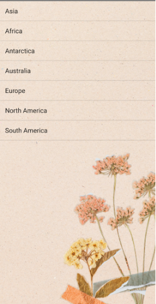
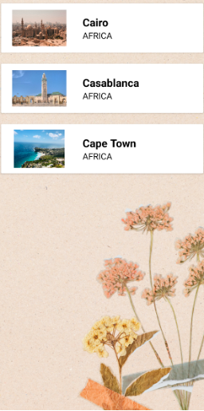
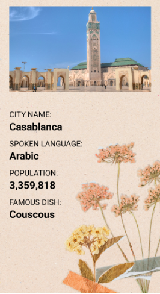

# GlobeTrek

## Project Description

This assignment focuses on utilizing **RecyclerViews**, **CardViews**, and **Fragments** in Kotlin to develop an application showcasing city details across different continents. When the user launches the app, a list of all seven continents is displayed. Upon selecting a continent, the cities from that continent are shown in a card view. For each city, users can explore additional details within a reusable fragment for a consistent presentation.

## Technical Details & Code Structure

This project is developed using **Android Studio** with Kotlin, and all activities are declared in the `AndroidManifest.xml` file.

### **MainActivity**
- Displays the list of continents using the `ListView` component.

### **ContinentActivity**
- Displays the list of cities based on the selected continent in a card view using `RecyclerView`.
- Files involved:
    - `activity_continent.xml` - Layout for `RecyclerView`.
    - `activity_city_cards.xml` - Layout for `CardView` with image and text view.
    - `City.kt` - Data class modeling the city object.
    - `CityAdapter.kt` - Binds the data to the views.
    - `CityCardViewHolder.kt` - Sets up the display items for the card.

### **CityInfoActivity**
- Hosts the `CityInfoFragment.kt` to display detailed city information.
- `CityInfoActivity.kt` sets the fragment view (`activity_city_fragments.xml`) and passes intent values from `CityAdapter.kt` to the fragment.

### **CityInfoFragment**
- Renders detailed city information received from `CityInfoActivity.kt`.

## Project Screenshots

### List of Continents

### List of Cities in Africa

### Details for the City Casablanca

## Conclusion

This assignment allowed me to explore the concepts of **RecyclerView**, **CardViews**, and **Fragments**. I also gained a deeper understanding of reusing components and passing data efficiently through intents.

## References

1. [“Android ListView in Kotlin” GeeksforGeeks](https://www.geeksforgeeks.org/android-listview-in-kotlin/)
2. [“Kotlin setOnClickListener for a ListView” StackOverflow](https://stackoverflow.com/questions/55128123/kotlin-setonclicklistener-for-a-listview)
3. [“RecyclerView” Android Developers](https://developer.android.com/reference/androidx/recyclerview/widget/RecyclerView)
4. [“CardView in Android with Example” GeeksforGeeks](https://www.geeksforgeeks.org/cardview-in-android-with-example/)
5. [“Fragment Transactions” Android Developers](https://developer.android.com/guide/fragments/transactions)
6. [“FragmentContainerView” Android Developers](https://developer.android.com/reference/androidx/fragment/app/FragmentContainerView)
7. [Canva](https://www.canva.com)
8. [Unsplash - Free Images](https://unsplash.com)

